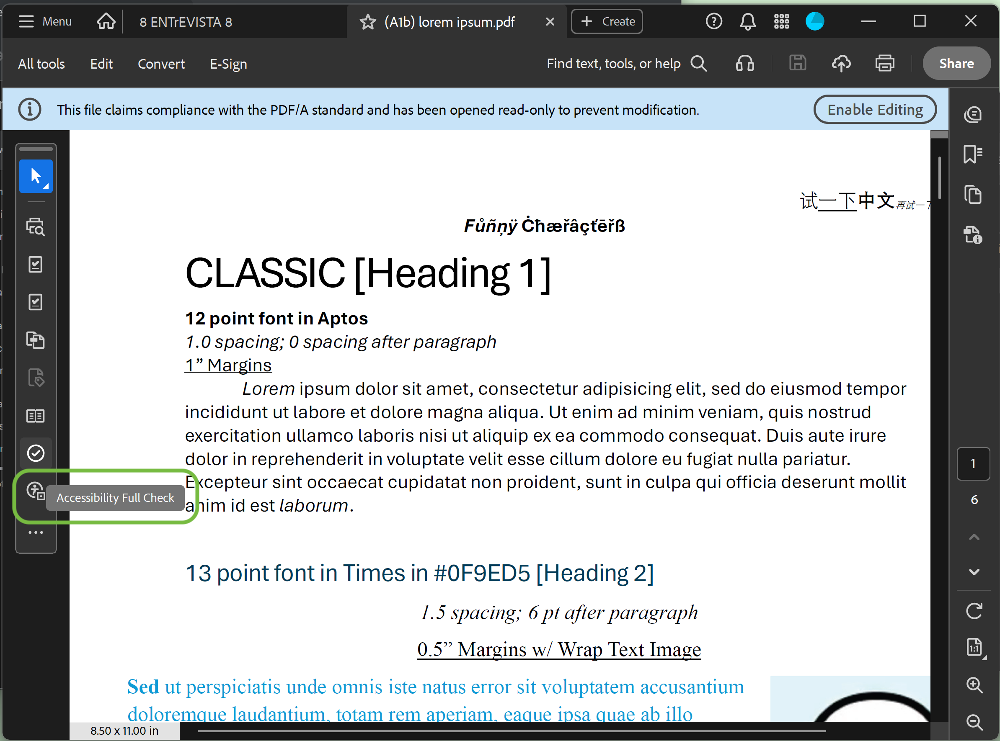
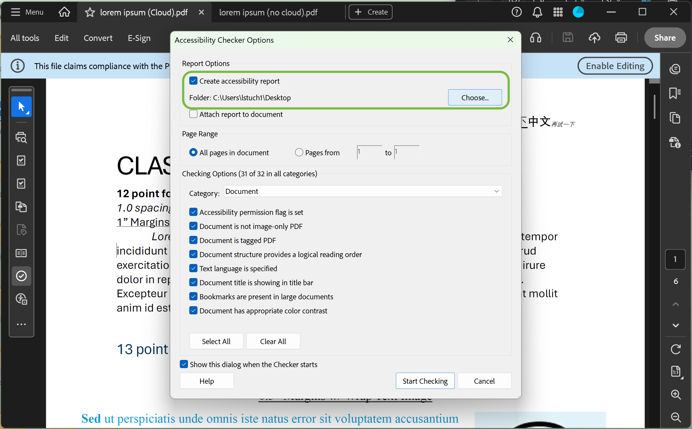
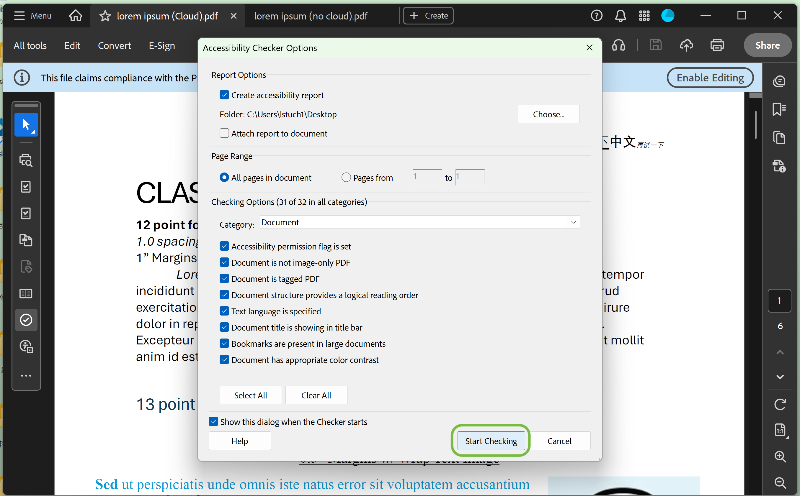

# Adobe Acrobat Accessibility Check Guide

## Overview
This guide documents how to run an accessibility check in Adobe Acrobat Pro to evaluate whether a PDF meets accessibility standards (e.g., for screen readers and WCAG compliance).

---

## Prerequisites
- Adobe Acrobat Pro (DC or newer)
- A PDF file to evaluate

---

## Step-by-Step Instructions

### 1. Open the PDF
- Launch **Adobe Acrobat Pro**
- Open the PDF file you want to check

---

### 2. Open the Accessibility Check Tool
- On the **left-hand side**, locate the vertical toolbar with icons
- Near the bottom, find the icon that looks like a **checkmark inside a circle**
- Hover over the icon — it will display: **"Accessibility Full Check"**
- Click this icon

---

### 3. Configure Accessibility Checker Options
A window titled **"Accessibility Checker Options"** will appear.

#### Report Options
- Ensure **"Create accessibility report"** is checked
- Click **"Choose..."** to select where to save the report

#### Page Range
- Select **"All pages in document"**

#### Checking Options
- Set the **"Category"** dropdown to **"Document"**
- Ensure all categories below are checked  
  - You can click **"Select All"** at the bottom to do this

---

### 4. Run the Accessibility Check
- Click **"Start Checking"** at the bottom of the **"Accessibility Checker Options"** window

---

### 5. Review Results
After the scan completes, results will appear in the **Accessibility Checker panel**.

Results are grouped into:
- **Passed** ✅  
- **Failed** ❌  
- **Needs Manual Check** ⚠️  

---

## Notes
- Accessibility checks should be run **after PDF creation and before final archival**
- Accessibility compliance is **not guaranteed by PDF/A alone**
- Manual review is still required for:
  - Reading order
  - Meaningful alt text
  - Logical structure
  