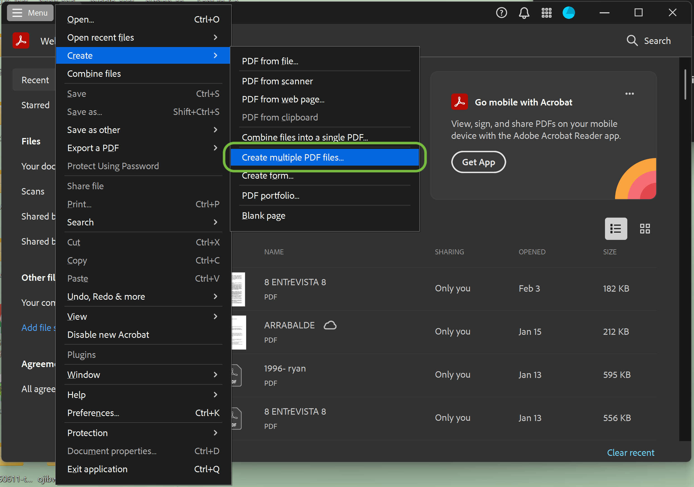
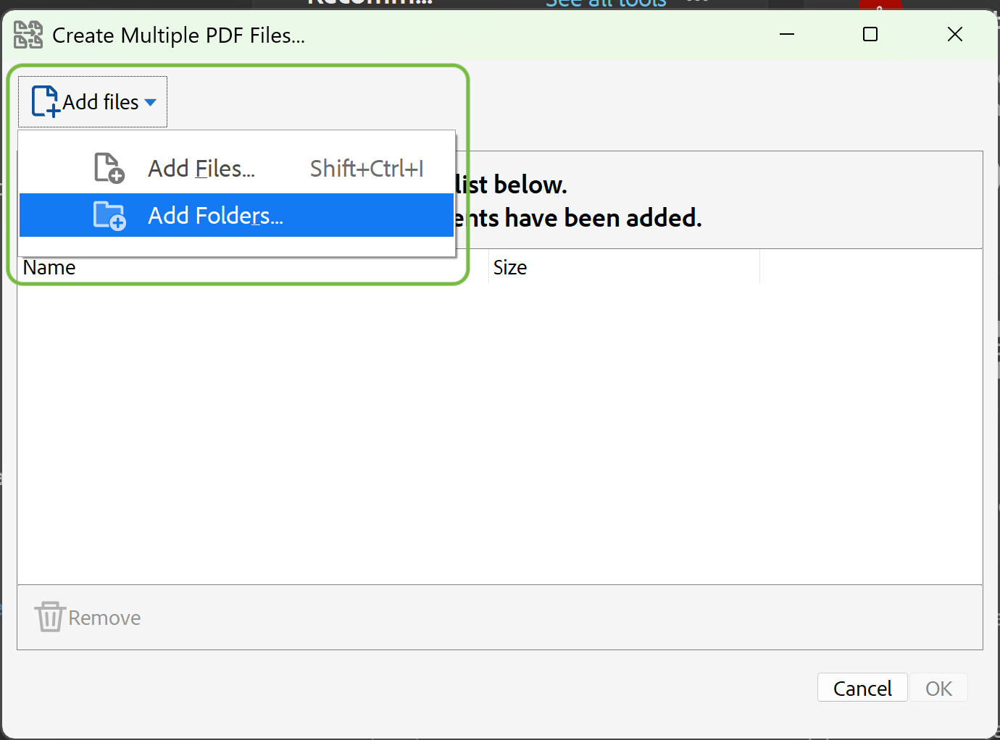
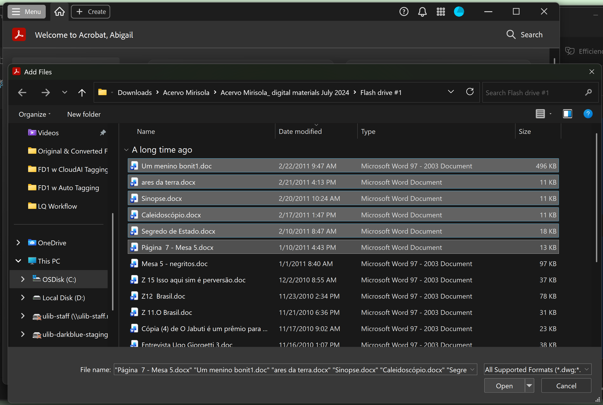
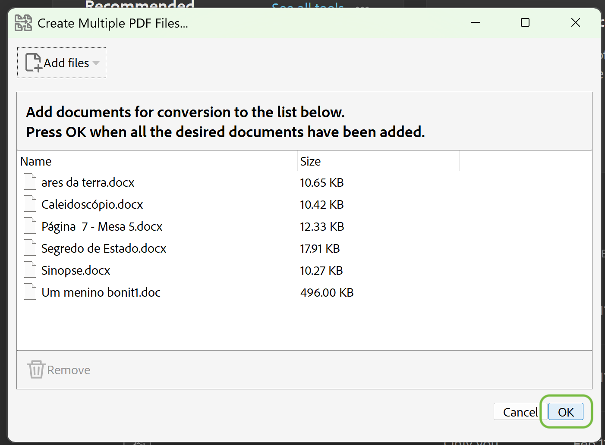
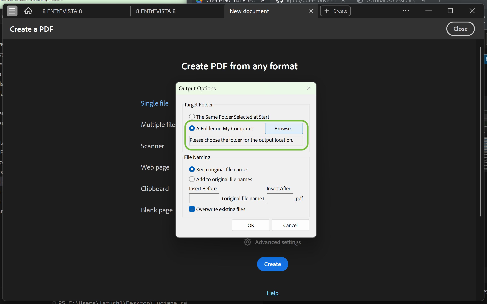
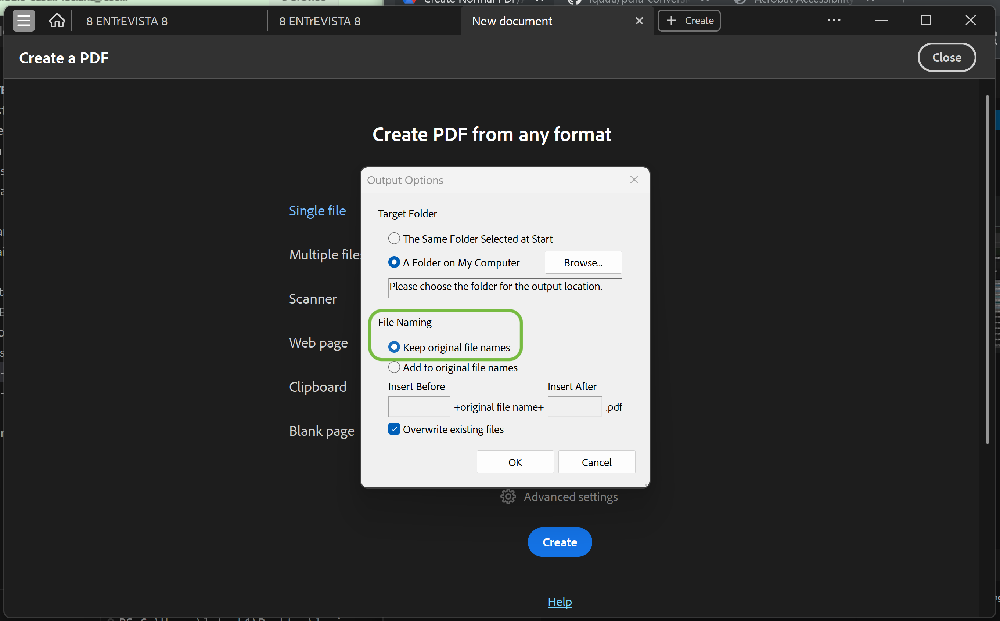
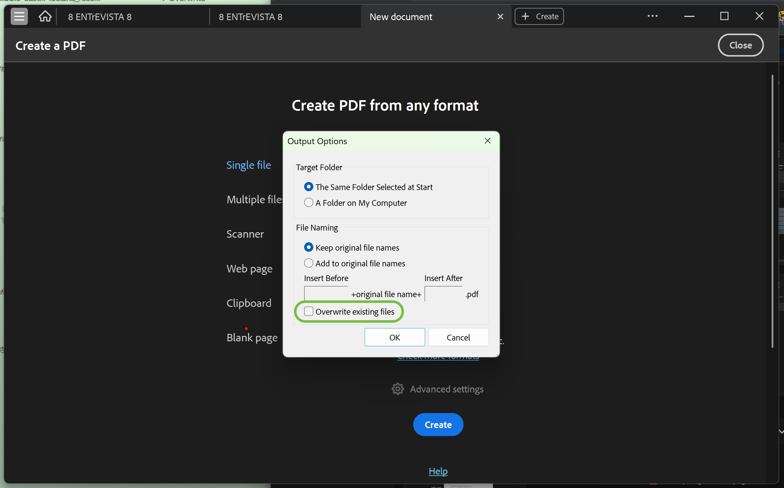

# Adobe Acrobat Create PDF: Batch Conversion Workflow

## 1. Purpose

This workflow describes a reproducible process for batch-converting DOC and DOCX files to PDF using Adobe Acrobat’s **Create PDF** tool.

This workflow serves as a baseline conversion method for **comparison** against PDF/A-specific workflows (e.g., Guided Actions targeting PDF/A-2u), and is included to document observed behavior, stability, and limitations during batch processing.

---

## 2. Inputs & Preconditions

- Source files: DOC and DOCX only, including legacy 1997–2003 DOC files
- Files may be added individually or via folders
- Mixed file types (e.g., LNK, JPG, existing PDFs) should be excluded prior to conversion
- Adobe Acrobat is installed and licensed

---

## 3. Batch Conversion via Create PDF

### 3.1 Selecting Multiple PDF Files for Conversion

1. Open Adobe Acrobat
2. Select **Menu** from the top left corner
3. Under **Create**, select **Create multiple PDF files**

---

### 3.2 Add Files for Batch Conversion

4. Select **Add files**

5. Select a folder or specific DOC/DOCX files in the pop-up window and click **Open**
 
6. Click **OK**

---

### 3.3 Configure Output Settings

7. Under **Target Folder**, select **A Folder on My Computer**. Then click **Browse…** and select the destination folder for converted PDFs.

8. Under **File Naming**, select **Keep original file names**

9. Ensure **Overwrite existing files** is unchecked. (Default is checked; and we typically need to uncheck it. However, you may choose to keep it checked due to specific needs.)

---

### 3.4 Run the Batch Conversion

10. Select **OK** to begin the conversion process
11. When the process completes, review any error messages or warnings

---

## 4. Outputs

- Standard PDF/A files saved to the designated output folder
- File naming preserved from original DOC/DOCX sources

---

## 5. Observed Behavior

Based on batch testing, the following behaviors have been observed when using "Create PDF" for large or mixed document sets:

- Increased likelihood of application crashes when processing mixed file types (e.g., `.png`) or shortcut (i.e., `.lnk`) files
- Reduced stability when processing deeply nested folder structures
- Limited transparency into batch-level failures without manual inspection

These behaviors may vary depending on file composition and system state.

---

## 6. Known Limitations

- Output files are **not** PDF/A compliant by default
- Unicode text mapping is not explicitly enforced
- Batch reports are limited compared to Guided Actions
- Less control over downstream preservation and access characteristics

---

## 7. Relation to Other Workflows

This workflow is intended to function as a baseline comparison for PDF/A-specific workflows documented elsewhere in this repository, including:
- `docx-to-pdfa2u-custom-action.md`

---

