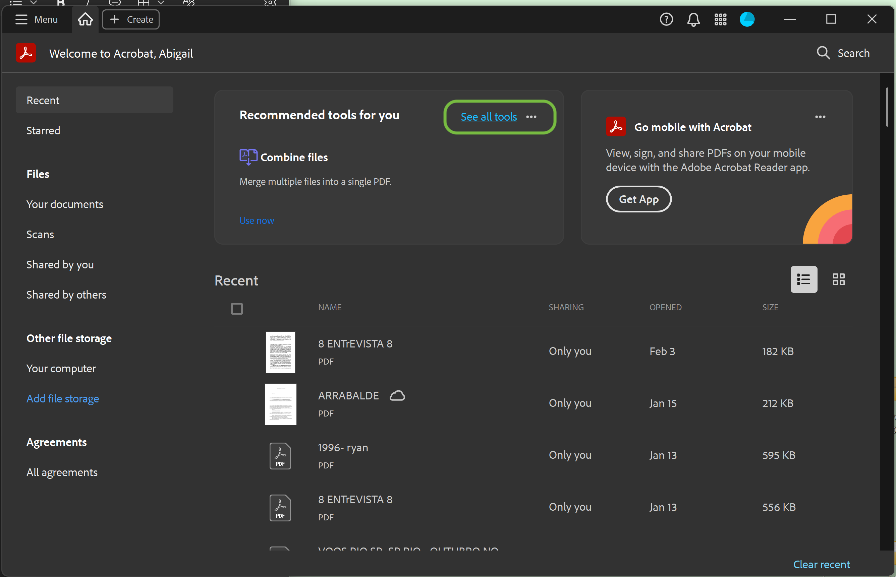
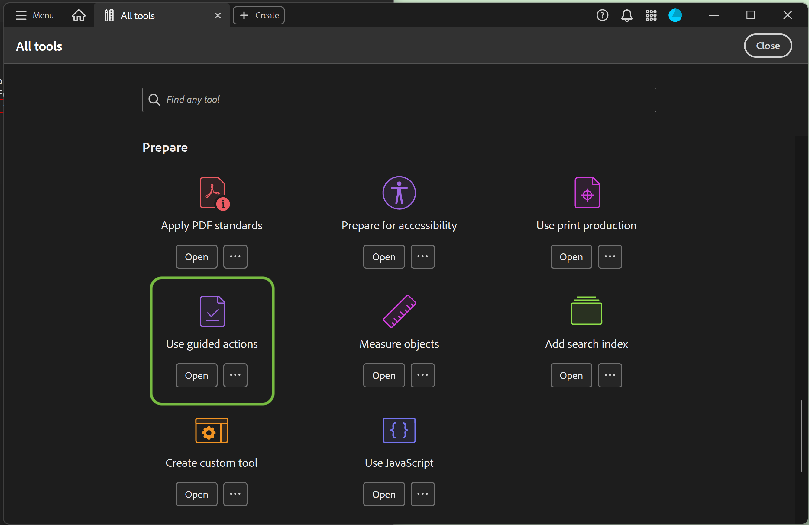
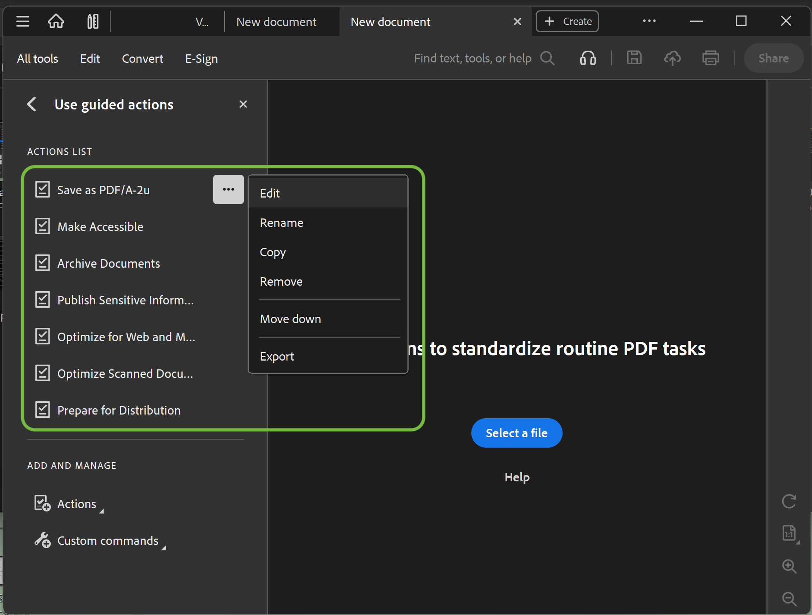
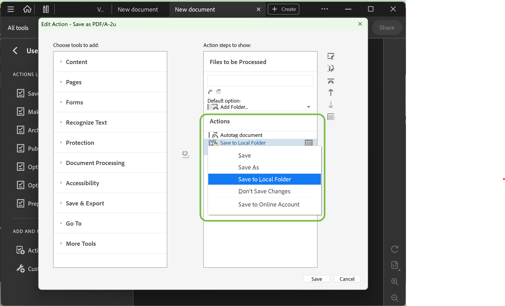
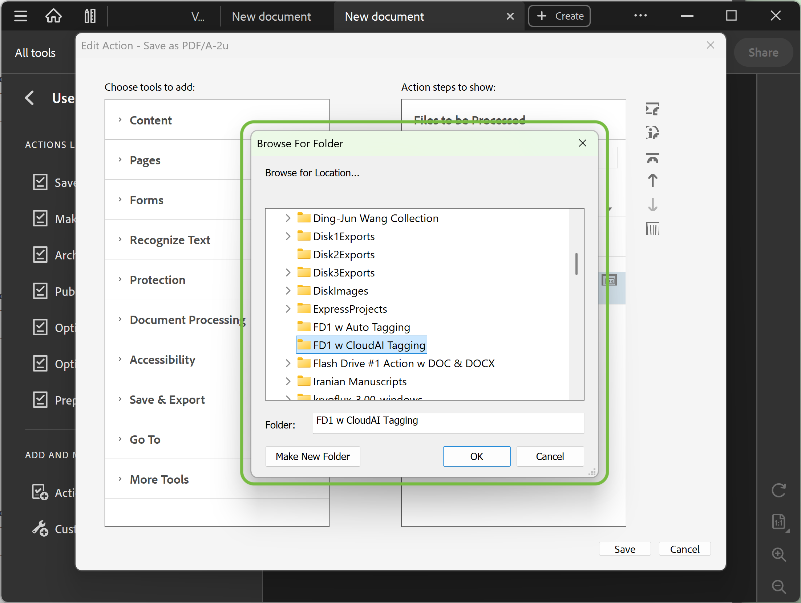
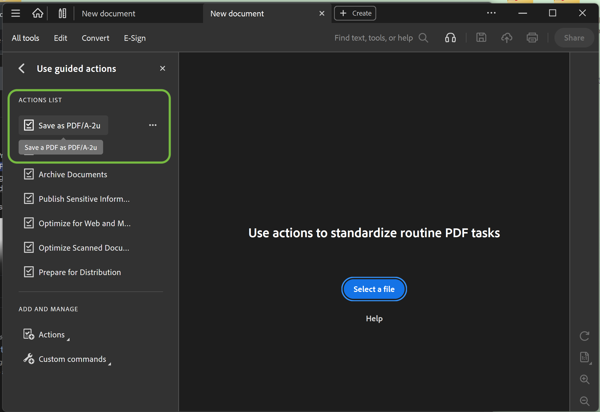
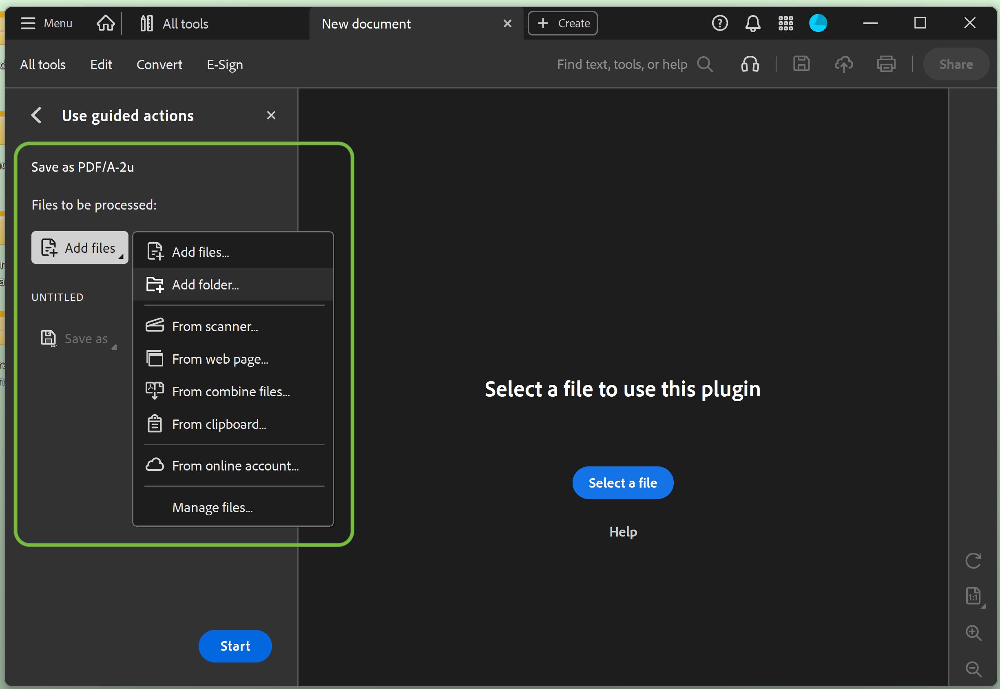
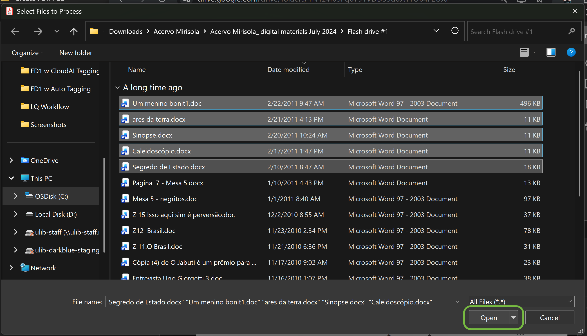
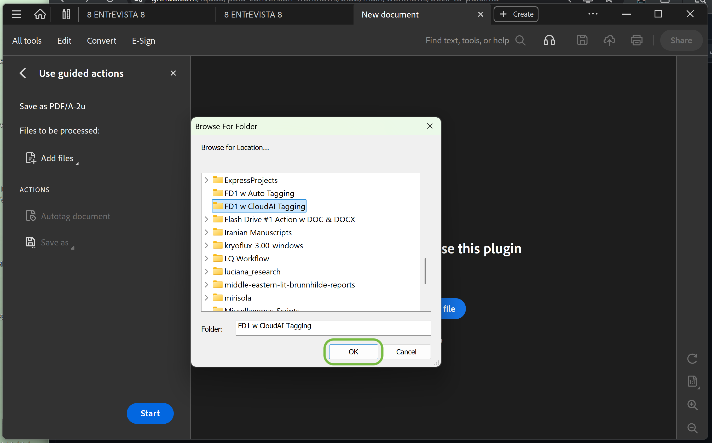
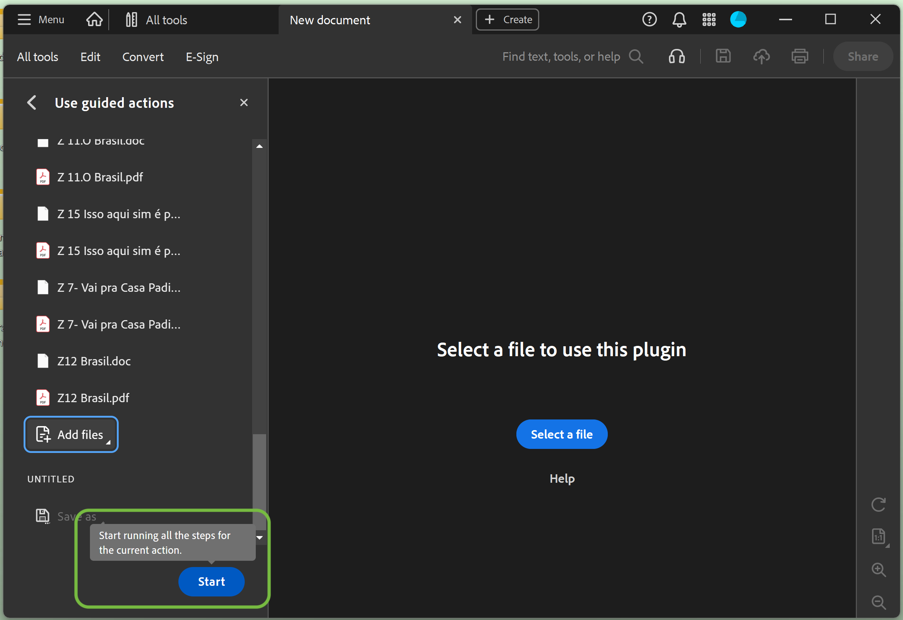

# Adobe Acrobat Guided Action: Batch Conversion to PDF/A-2u

## 1. Purpose
This workflow describes a reproducible process for batch-converting DOC and DOCX files to PDF/A-2u using Adobe Acrobat’s Guided Actions.

The workflow is designed for digital preservation and access contexts where Unicode text extractability and reliable PDF/A compliance are required.

---

## 2. Inputs & Preconditions

- Source files: DOC and DOCX only, including legacy 1997–2003 DOC files
- Files may be added individually or via folders
- Non-DOC/DOCX files (e.g., LNK, JPG, existing PDFs) should be excluded prior to conversion
- An Adobe Guided Action named **Save as PDF/A-2u** must already be created
- Adobe Acrobat is installed and licensed

---

## 3. Batch Conversion via Adobe Guided Actions

### 3.1 Open & Edit the Guided Action

1. Open Adobe Acrobat
2. Select **See all tools**

3. Under **Prepare**, open **Use Guided Actions**

4. Locate the action **Save as PDF/A-2u**
5. Select the **…** menu and choose **Edit**

6. In the right-hand column, locate **Save to Local Folder**
7. Click on **Save to Local Folder** and select **Save to Local Folder** from the dropdown

8. Choose the destination folder for converted PDF/A-2u files

9. Click **OK**, then **Save**

---

### 3.2 Run the Batch Conversion

10. Select the **Save as PDF/A-2u** action.

11. Select **Add files…** or **Add folder…**

11. Choose the DOC/DOCX files or folder to convert
12. For DOC/DOCX files, click **Open**. For folders, click **OK**

13. Select **Start** to begin the conversion

14. When complete, select **Done**
*Optional: Selecting **Full report** generates an HTML summary of the batch process.*

---

## 4. Outputs

- PDF/A-2u files saved to the designated output folder
- Optional HTML batch report generated by Adobe Acrobat

---

## 5. Next Steps

For end-to-end workflows and post-conversion analysis, see:

- `docx-to-pdfa2u-with-metadata.md` — full DOCX → PDF/A-2u (end-to-end) workflow with metadata comparison
- `../metadata/metadata-comparison-method.md` — detailed metadata extraction and comparison method
